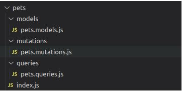

## How to Build a GraphQL API with Node and Apollo GraphQL

### Our Tools

- Node.js
<!-- https://nodejs.org/en -->
- Apollo GraphQL
<!-- https://www.apollographql.com/ -->

## Our Architecture

### For this project we'll follow a layers architecture in our codebase. Layers architecture is about dividing concerns and responsibilities into different folders and files, and allowing direct communication only between certain folders and files.

### The matter of how many layers should your project have, what names should each layer have, and what actions should it handle is all a matter of discussion. So let's see what I think is a good approach for our example.

## These layers description is as follows:-

- The application layer will have the basic setup of our server and the connection to our schema and resolvers (the next layer).

- The schema and resolvers layer will have the type definitions for our data and the connection to our queries and mutations (the next layer).

- The queries and mutations layer will have the actual logic we want to perform in each of our queries and mutations and the connection to the model layer (the next layer, you get the idea...)

- The model layer will hold the logic for interacting with our mock database.

- Finally, the persistence layer is where our database will be.

## The Code

### Before jumping to the code, let's mention what we'll actually build. We'll be building an API for a pet shelter business. This pet shelter needs to register the pets that are staying in the shelter, and for that we'll perform basic CRUD operations (create, read, update and delete).

### Now let's get this thing going. Create a new directory, hop in to it and start a new Node project by running npm init -y. For our GraphQL server we'll need two more dependencies, so run npm i @apollo/server and npm i graphql.

## App.js

### In the root of your project, create an app.js file and drop this code in it:

```
import { ApolloServer } from '@apollo/server'
import { startStandaloneServer } from '@apollo/server/standalone'
import { typeDefs, resolvers } from './pets/index.js'

const server = new ApolloServer({
    typeDefs,
    resolvers
})

const { url } = await startStandaloneServer(server, {
    listen: { port: 4000 }
})

console.log(`🚀  Server ready at: ${url}`)
```

### Here we're setting up our Apollo server, by passing it our typeDefs and resolvers (we'll explain those in a sec), and then starting the server in port 4000.

### Next, go ahead and create this folder structure in your project:



## index.js

### Within the index.js file put this code:

```
import { addPet, editPet, deletePet } from './mutations/pets.mutations.js'
import { listPets, getPet } from './queries/pets.queries.js'

// A schema is a collection of type definitions (hence "typeDefs")
// that together define the "shape" of queries that are executed against your data.
export const typeDefs = `#graphql
  # OBJECT TYPES
  # This "Pet" type defines the queryable fields for every pet in our data source.
  type Pet {
    id: ID!
    name: String!
    type: String!
    age: Int!
    breed: String!
  }

  # INPUT TYPES
  # Define the input objects for addPet and editPet mutations
  input PetToEdit {
    id: ID!
    name: String!
    type: String!
    age: Int!
    breed: String!
  }

  input PetToAdd {
    name: String!
    type: String!
    age: Int!
    breed: String!
  }

  # The "Query" type is special: it lists all of the available queries that
  # clients can execute, along with the return type for each. In this
  # case, the "pets" query returns an array of zero or more pets.
  # QUERY TYPES
  type Query {
    pets: [Pet],
    pet(id: ID!): Pet
  }

  # MUTATION TYPES
  type Mutation {
    addPet(petToAdd: PetToAdd!): Pet,
    editPet(petToEdit: PetToEdit!): Pet,
    deletePet(id: ID!): [Pet],
  }
`

export const resolvers = {
    // Resolvers for Queries
    Query: {
        pets: () => listPets(),
        pet: (_, { id }) => getPet(id)
    },

    // Resolvers for Mutations
    Mutation: {
        addPet: (_, { petToAdd }) => addPet(petToAdd),
        editPet: (_, { petToEdit }) => editPet(petToEdit),
        deletePet: (_, { id }) => deletePet(id)
    }
}

```

## Here we have two main things: typeDefs and resolvers.

### typeDefs defines the types for the data that can be queried in our API (in our case that's the `pet` object), as well as the input for queries/mutations (in our case that's `PetToEdit` and `PetToAdd`).

### Lastly, it also defines the available queries and mutations for our API, declaring their names, as well as their input and return values. In our case we have two queries (`pets` and `pet`) and three mutations (`addPet`, `editPet` and `deletePet`).

### `resolvers` contain the actual implementation of our queries and mutations types. Here we're declaring each query and mutation, and indicating what each should do. In our case, we're linking them with the queries/mutations we're importing from our queries/mutations layer.

## pets.queries.js

### In your pets.queries.js file drop this:

```
import { getItem, listItems } from '../models/pets.models.js'

export const getPet = id => {
    try {
        const resp = getItem(id)
        return resp
    } catch (err) {
        return err
    }
}

export const listPets = () => {
    try {
        const resp = listItems()
        return resp
    } catch (err) {
        return err
    }
}
```

### As you can see, this file is very simple. It declares the functions that are imported in the `index.js` file and links them to the functions declared in the models layer.

## pets.mutations.js

### Same goes for our pets.mutations.js file, but with mutations now.

```
import { editItem, addItem, deleteItem } from '../models/pets.models.js'

export const addPet = petToAdd => {
    try {
        const resp = addItem(petToAdd)
        return resp
    } catch (err) {
        return err
    }
}

export const editPet = petToEdit => {
    try {
        const resp = editItem(petToEdit?.id, petToEdit)
        return resp
    } catch (err) {
        return err
    }
}

export const deletePet = id => {
    try {
        const resp = deleteItem(id)
        return resp
    } catch (err) {
        return err
    }
}
```

## pets.models.js

### Now go to the models folder and create a pets.models.js file with this code in it:

```
import db from '../../db/db.js'

export const getItem = id => {
    try {
        const pet = db?.pets?.filter(pet => pet?.id === parseInt(id))[0]
        return pet
    } catch (err) {
        console.error('Error', err)
        return err
    }
}

export const listItems = () => {
    try {
        return db?.pets
    } catch (err) {
        console.error('Error', err)
        return err
    }
}

export const editItem = (id, data) => {
    try {
        const index = db.pets.findIndex(pet => pet.id === parseInt(id))

        if (index === -1) throw new Error('Pet not found')
        else {
            data.id = parseInt(data.id)
            db.pets[index] = data
            return db.pets[index]
        }
    } catch (err) {
        console.error('Error', err)
        return err
    }
}

export const addItem = data => {
    try {
        const newPet = { id: db.pets.length + 1, ...data }
        db.pets.push(newPet)
        return newPet
    } catch (err) {
        console.error('Error', err)
        return err
    }
}

export const deleteItem = id => {
    try {
        // delete item from db
        const index = db.pets.findIndex(pet => pet.id === parseInt(id))

        if (index === -1) throw new Error('Pet not found')
        else {
            db.pets.splice(index, 1)
            return db.pets
        }
    } catch (err) {
        console.error('Error', err)
        return err
    }
}
```

### These are the functions responsible for interacting with our data layer (database) and returning the corresponding information to our controllers.

## Database

### We wont use a real database for this example. Instead we'll just use a simple array that will work just fine for example purposes, though our data will of course reset every time our server does.

### In the root of our project, create a db folder and a db.js file with this code in it:

```
const db = {
    pets: [
        {
            id: 1,
            name: 'Rex',
            type: 'dog',
            age: 3,
            breed: 'labrador',
        },
        {
            id: 2,
            name: 'Fido',
            type: 'dog',
            age: 1,
            breed: 'poodle',
        },
        {
            id: 3,
            name: 'Mittens',
            type: 'cat',
            age: 2,
            breed: 'tabby',
        },
    ]
}

export default db
```

### As you can see, our db object contains a pets property whose value is an array of objects, each object being a pet. For each pet, we store an id, name, type, age and breed.

### Now go to your terminal and run nodemon app.js. You should see this message confirming your server is alive: 🚀 Server ready at: [http://localhost:4000/](http://localhost:4000/).
